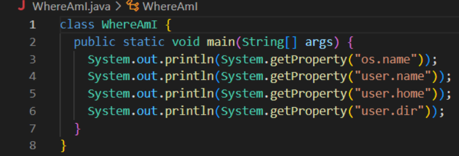

# Lab 1
## 1: Installing VS Code

- I already had VS Code downloaded from previous use, but I believe you can install for your respective OS at https://code.visualstudio.com/download 
- Once installed and opened, VS Code should look something like that

## 2: Remotely Connecting

- Use command ssh cs15lfa22xx@ieng6.ucsd.edu (where xx is your two letter sign in)
- You will then be prompted to type your account password (the field will remain blank)

## 3: Trying Some Commands
On the Remote Computer:

On Personal Computer:

- Type the commands cd, ls, pwd, mkdir <directory>, and cp <file/directory> on the remote computer
- Exit the remote computer using CTRL-D or the command exit
- Type the commands cd, ls, pwd, mkdir <directory>, and cp <file/directory> on your personal computer

## 4: Moving Files with SCP
- Create and save a file on your personal computer called WhereAmI.java with the following:
class WhereAmI {
  public static void main(String[] args) {
    System.out.println(System.getProperty("os.name"));
    System.out.println(System.getProperty("user.name"));
    System.out.println(System.getProperty("user.home"));
    System.out.println(System.getProperty("user.dir"));
  }
}

On Personal Computer:
- Run the commands javac WhereAmI.java and java WhereAmI
- Run the command scp WhereAmI.java cs15lfa22xx@ieng6.ucsd.edu : ~/ using your two letter characters for xx. Enter your password.

On Remote Computer:

- Check that the file was copied over by running the commands javac WhereAmI.java and java WhereAmI

## 5: Setting an SSH Key
## 6: Optimizing Remote Running