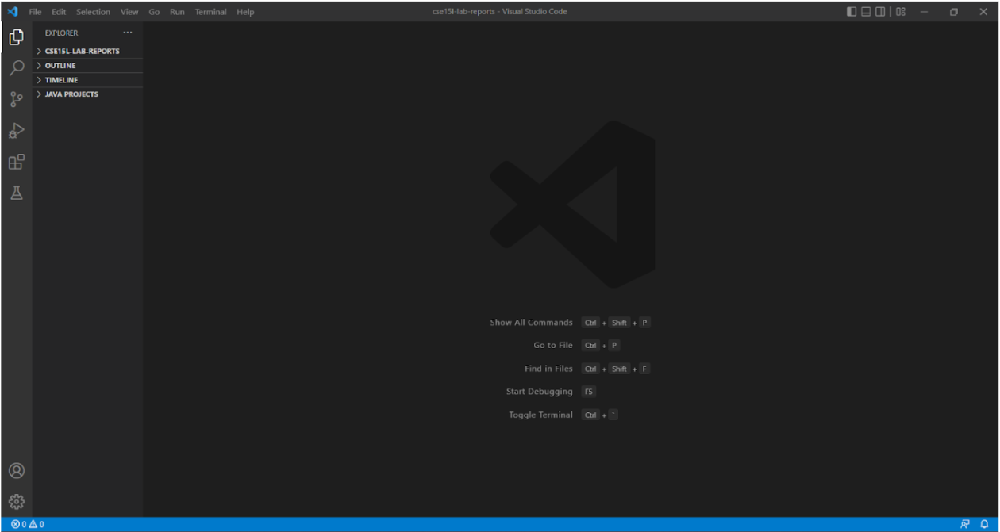
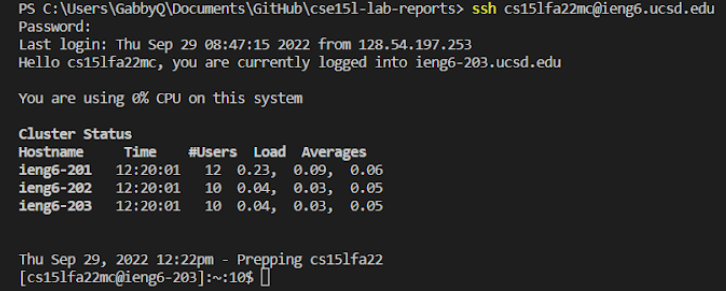
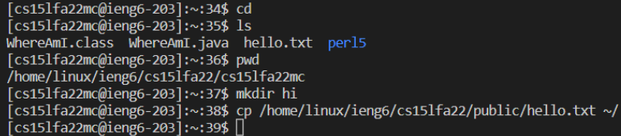
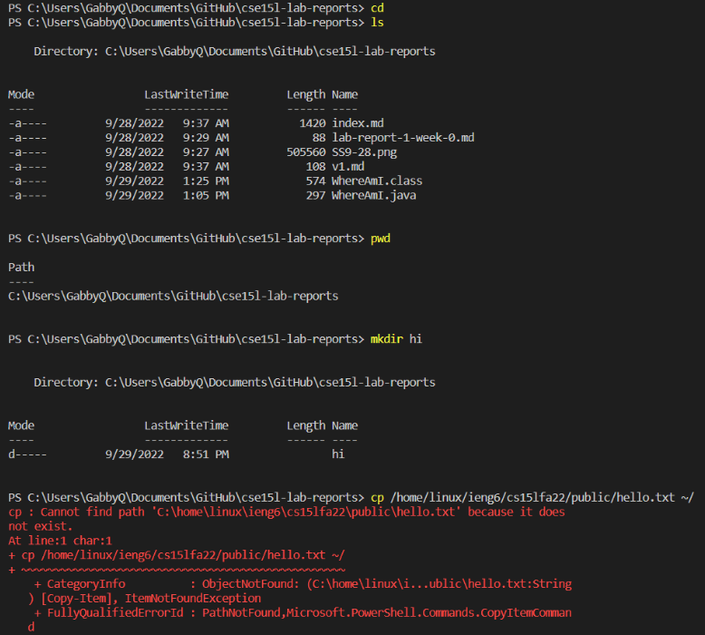
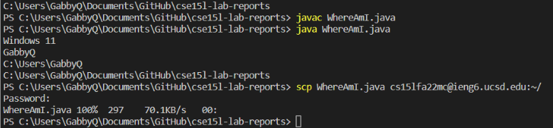
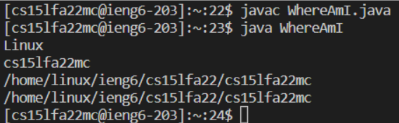
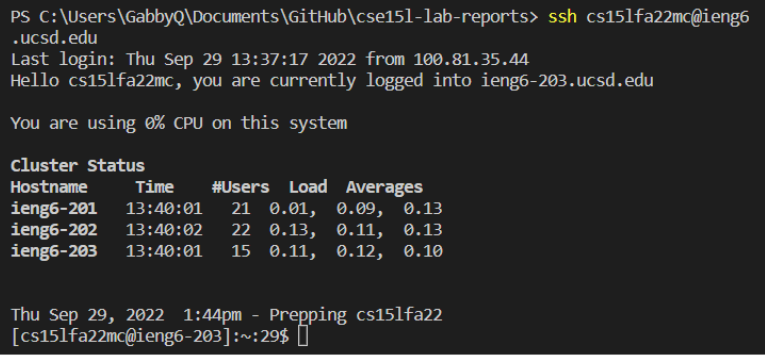
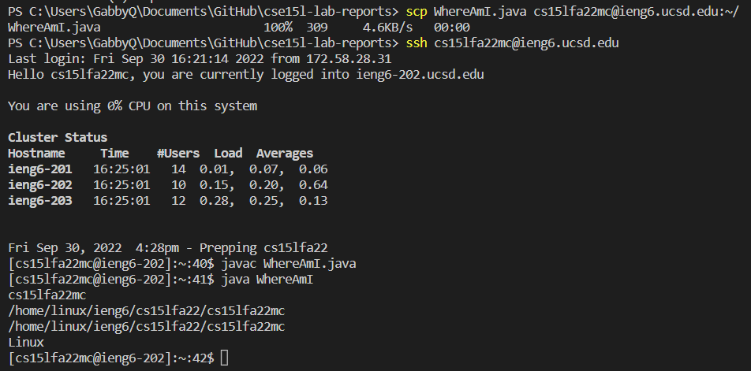

# Lab 1 Report
## 1: Installing VS Code
- I already had VS Code downloaded from previous use, but I believe you can install for your respective OS at https://code.visualstudio.com/download 
- Once installed and opened, VS Code should look something like this:

- To open terminal, do CTRL + `

## 2: Remotely Connecting
- Use command `ssh cs15lfa22xx@ieng6.ucsd.edu` (where xx is your two letter sign in)
- You will then be prompted to type your account password (the field will remain blank)
  

## 3: Trying Some Commands
**On Remote Server:**
- Type the commands `cd`, `ls`, `pwd`, `mkdir <directory>`, and `cp <file/directory>`


- Exit the remote computer using CTRL-D or the command exit

**On Personal Computer:**
- Type the commands `cd`, `ls`, `pwd`, `mkdir <directory>`, and `cp <file/directory>` on your personal computer


## 4: Moving Files with SCP
- Create and save a file on your personal computer called WhereAmI.java with the following:
```
class WhereAmI {
  public static void main(String[] args) {
    System.out.println(System.getProperty("os.name"));
    System.out.println(System.getProperty("user.name"));
    System.out.println(System.getProperty("user.home"));
    System.out.println(System.getProperty("user.dir"));
  }
}
```

**On Personal Computer:**
- Run the commands `javac WhereAmI.java` and `java WhereAmI`
- Run the command `scp WhereAmI.java cs15lfa22xx@ieng6.ucsd.edu : ~/ `using your two letter characters for xx. Enter your password.


**On Remote Server:**
- Check that the file was copied over by running the commands `javac WhereAmI.java` and `java WhereAmI`


## 5: Setting an SSH Key
**On Personal Computer:**
- On your computer, run the command `ssh-keygen`
- When you are prompted to “Enter file in which to save the key (/Users/<Your User>/.ssh/id_rsa):”, press enter to specify the default path
- Command ssh cs15lfa22zz@ieng6.ucsd.edu, and enter your password when prompted to

**On Remote Server:**
- Command `mkdir .ssh`,  then log out

**On Personal Computer:**
- Command `scp /Users/<Your Personal User>/.ssh/id_rsa.pub cs15lfa22@ieng6.ucsd.edu:~/.ssh/authorized_keys`

This is what it should look like when you ssh into the remote computer from your personal computer now:


## 6: Optimizing Remote Running
**On Your Computer:**
- Make a local edit to the WhereAmI.java file
- Use the up arrow to scp the WhereAmI.java file onto the remote computer
- Up arrow to ssh into remote computer
- Up arrow to javac the WhereAmI.java file
- Up arrow to run java command


