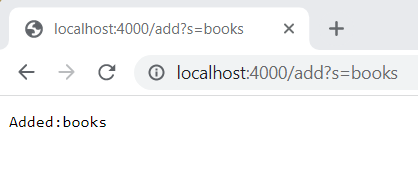
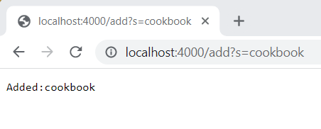
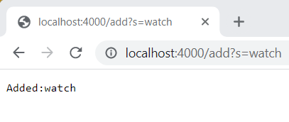
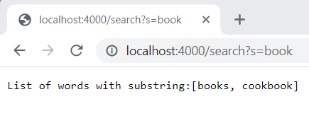
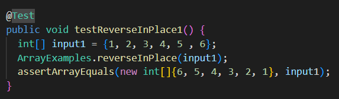
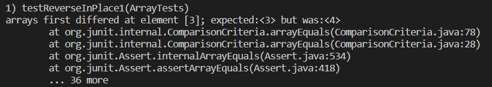
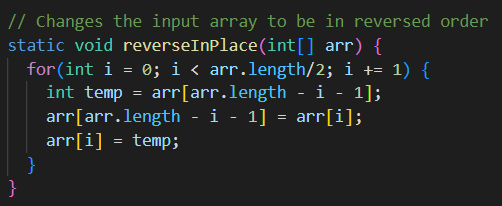
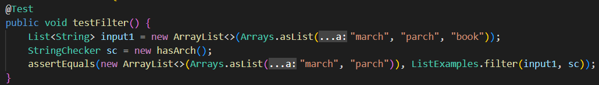
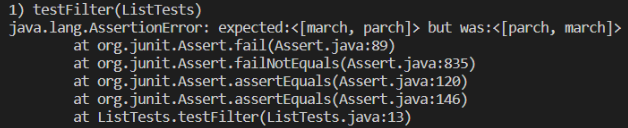

# Lab Report 2
## Part 1: Search Engine
```
import java.io.IOException;
import java.net.URI;
import java.util.ArrayList;

class Handler implements URLHandler {
    ArrayList<String> listOfWords = new ArrayList<>();
    public String handleRequest(URI url) {
        if (url.getPath().contains("/add")){
            String[] parameters = url.getQuery().split("=");
            if (parameters[0].equals("s")) {
                listOfWords.add(parameters[1]);
            }
            return String.format("Added:" + parameters[1]);
        }else if (url.getPath().contains("/search")){
            ArrayList<String> wordsWithSub = new ArrayList<>();
            String[] parameters = url.getQuery().split("=");
            if (parameters[0].equals("s")) {
                for(int i = 0; i < listOfWords.size(); i++){
                    if(listOfWords.get(i).contains(parameters[1])){
                        wordsWithSub.add(listOfWords.get(i));
                    }
                }
                return String.format("List of words with substring:" + wordsWithSub);
            }
        }else{
            return "Add a String!";
        }
        return "Add a String!";
    }
}

class SearchEngine {
    public static void main(String[] args) throws IOException {
        if(args.length == 0){
            System.out.println("Missing port number! Try any number between 1024 to 49151");
            return;
        }
        int port = Integer.parseInt(args[0]);
        Server.start(port, new Handler());
    }
}
```

- **Calls the handleRequest method**
    - url = localhost:4000/add?s=books
    - parameters = [s, books]
    - listOfWords = [books]
    - listOfWords is first initialized in Handler as a empty array list, which is []. Then, listOfWords adds books to the array list and it becomes [books].
- **Calls the main method**
    - args = [4000]
    - port = 4000
    - The arguments in main do not change

---


- **Calls the handleRequest method**
    - url = localhost:4000/add?s=cookbook
    - parameters = [s, cookbook]
    - listOfWords =[books, cookbook]
    - listOfWords adds cookbook to the array list and it changes from [books] to [books, cookbook].
- **Calls the main method**
    - args = [4000]
    - port = 4000
    - The arguments in main do not change

---


- **Calls the handleRequest method**
    - url = localhost:400/add?s=watch
    - parameters = [s, watch]
    - listOfWords = [books, cookbook, watch]
    - listOfWords adds watch to the array list and it changes from [books, cookbook] to [books, cookbook, watch].
- **Calls the main method**
    - args = [4000]
    - port = 4000
    - The arguments in main do not change

---


- **Calls the handleRequest method**
    - url = localhost:4000/search?s=book
    - parameters = [s, book]
    - wordsWithSub = [books, cookbook]
    - wordsWithSub is first intialized in handleRequest as an empty array list which is []. Then wordsWithSub adds book and cookbook to the array list and it becomes [books, cookbook].
- **Calls the main method**
    - args = [4000]
    - port = 4000
    - The arguments in main do not change

---

## Part 2 - Bugs
### Array Methods - Reverse in Place
**The failure-inducing input:** {1, 2, 3, 4, 5, 6}



**The symptom:** array first differed at element [3]; expected:<3> but was: <4>


**The bug:** arr was overrwritting itself by taking the value of another index as arr[i], but not assigning the value of arr[i], thus ending up with symmetrical arrays. For example, {1, 2, 3, 4, 5, 6} would rearrage into {6, 5, 4, 4, 5, 6}. See below how the bug is fixed by storing arr[i] in a temp variable, then reassigning it.



**Connection between the symptom and the bug:** The bug causes the array to take numbers from the opposite side, but does not reassign the original numbers, leaving it {6, 2, 3, 4, 5, 6} after the first pass, {6, 5, 3, 4, 5, 6} after the second pass and so on. Since the numbers are never truly swapped, at element [3], we end up with 4 as it mirrors element [2].

### List Methods - Filter
**The failure-inducing input):**  [“march”, “parch”, “book”]



**The symptom:** java.lang.AssertionError: expected:<[march, parch]> but was:<[parch, march]>.



**The bug:** In the for loop, after the if statement has determined that sc is in s, it does `result.add(0,s)`, which leads to the array list's contents being backwards. To fix this, the statement should be `result.add(s)`, so s is added to the end of the list instead of the front.

**Connection between the symptom and the bug:** The symptom was <[parch, march]>. This happened because `result.add(0,s)` sent parch to the 0 index position, when it should've just been sent to the back of the list to be <[march,parch]>