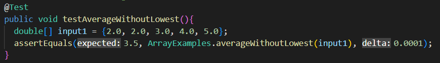
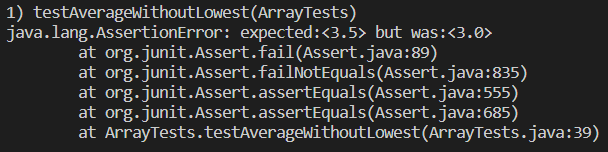

# Lab Report 3
## Part 1: Search Engine
```
import java.io.IOException;
import java.net.URI;
import java.util.ArrayList;

class Handler implements URLHandler {
    ArrayList<String> listOfWords = new ArrayList<>();
    public String handleRequest(URI url) {
        if (url.getPath().contains("/add")){
            String[] parameters = url.getQuery().split("=");
            if (parameters[0].equals("s")) {
                listOfWords.add(parameters[1]);
            }
            return String.format("Added:" + parameters[1]);
        }else if (url.getPath().contains("/search")){
            ArrayList<String> wordsWithSub = new ArrayList<>();
            String[] parameters = url.getQuery().split("=");
            if (parameters[0].equals("s")) {
                for(int i = 0; i < listOfWords.size(); i++){
                    if(listOfWords.get(i).contains(parameters[1])){
                        wordsWithSub.add(listOfWords.get(i));
                    }
                }
                return String.format("List of words with substring:" + wordsWithSub);
            }
        }else{
            return "Add a String!";
        }
        return "Add a String!";
    }
}

class SearchEngine {
    public static void main(String[] args) throws IOException {
        if(args.length == 0){
            System.out.println("Missing port number! Try any number between 1024 to 49151");
            return;
        }
        int port = Integer.parseInt(args[0]);
        Server.start(port, new Handler());
    }
}
```

- Calls the handleRequest method
- url = localhost:4000/add?s=books
- parameters = [s, books]
- listOfWords = [books]


- Calls the handleRequest method
- url = localhost:4000/add?s=cookbook
- parameters = [s, cookbook]
- listOfWords =[books, cookbook]


- Calls the handleRequest method
- url = localhost:400/add?s=watch
- parameters = [s, watch]
- listOfWords = [books, cookbook, watch]


- Calls the handleRequest method
- url = localhost:4000/search?s=book
- parameters = [s, book]
- wordsWithSub = [books, cookbook]

## Part 2
### Array Methods - Reverse in Place
**The failure-inducing input:** {1, 2, 3, 4, 5, 6}


**The symptom:** array first differed at element [3]; expected:<3> but was: <4>


**The bug:** arr was overrwritting itself by taking the value of another index as arr[i], but not assigning the value of arr[i], thus ending up with symmetrical arrays. For example, {1, 2, 3, 4, 5, 6} would rearrage into {6, 5, 4, 4, 5, 6}. See below how the bug is fixed by storing arr[i] in a temp variable, then reassigning it.


**Connection between the symptom and the bug:** The bug causes the array to take numbers from the opposite side, but does not reassign the original numbers, leaving it {6, 2, 3, 4, 5, 6} after the first pass, {6, 5, 3, 4, 5, 6} after the second pass and so on. Since the numbers are never truly swapped, at element [3], we end up with 4 as it mirrors element [2].

### Array Methods - Average Without Lowest
**The failure-inducing input):** {2.0, 2.0, 3.0, 4.0, 5.0}


**The symptom:** java.lang.AssertionError: expected:<3.5> but was:<3.0>


**The bug:** When passing through every element of the array to get the sum without the lowest element, it uses the `if(nums != lowest)` statement. However, this statement does not account for the fact that there may be multiple of the lowest number. To fix this, the statement should be removed and the sum off all numbers should be collected and later to get the sum without the lowest the program can do sum - lowest.

**Connection between the symptom and the bug:** The symptom was 3.0, which is 3.0+4.0+5.0 / 4. This happened because both of the 2.0 elements were omitted from the sum as they are both the "lowest".