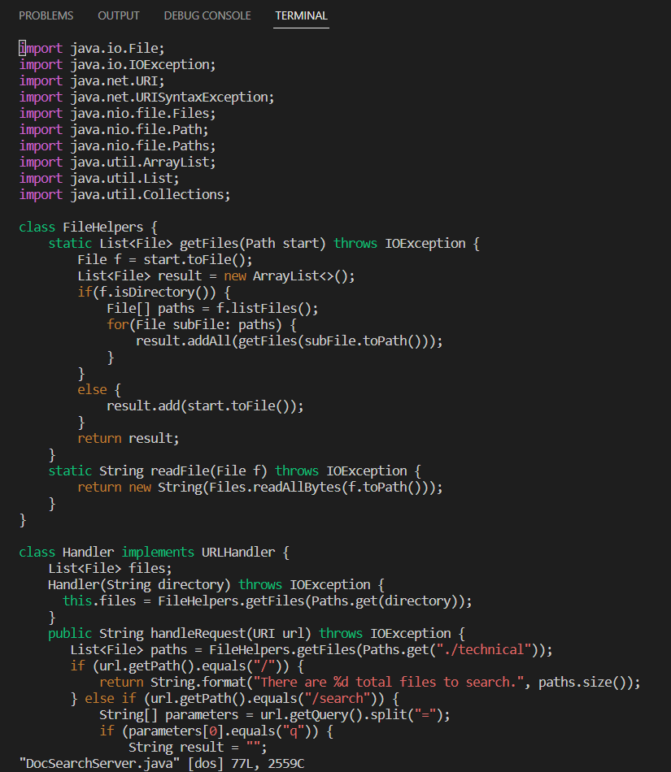
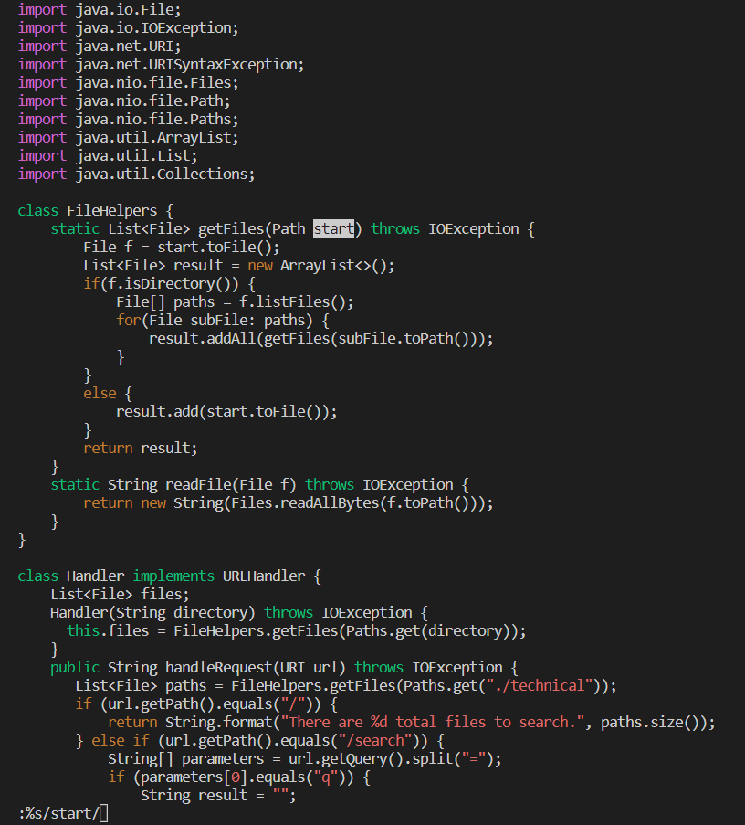
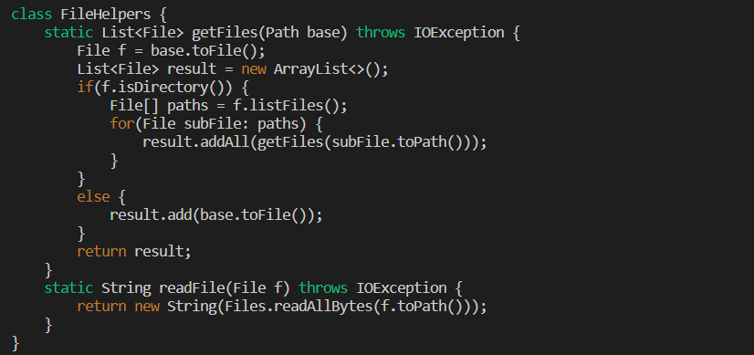

# Lab Report 4
## Part 1: Changing the name of the start parameter and its uses to base
`vim DocSearchServer.java<Enter>`
`:%s/<start>/<base>/g`
### After `vim DocSearchServer.java<Enter>`

### After `:%s/<start>/`

### After `<base>/g`

--- 

## Part 2: Local and SCP vs. SSH and Vim
### **Start in Visual Studio Code and make the edit there, then scp the file to the remote server and run it there:**
It took me 1 minute 4 seconds. I did not run into any problems.

### **Log into a ssh session. Make the edit, exit Vim and run bash test.sh:**
It took me 44 seconds. I did not run into any problems.

### **Which of these two styles would you prefer using if you had to work on a program that you were running remotely, and why?**
I prefer to use the method of logging into an ssh session and making the edits in Vim. It is faster, and it has less steps, which reduces the chance of error.
### **What about the project or task might factor into your decision one way or another? (If nothing would affect your decision, say so and why!)**
If I had to do a project that involed editing multiple files in the same directory, I would opt to make the edits locally then scp the file over. This is because it is easier to navigate editing multiple files locally, as you can switch files faster or even edit files simultaneously.