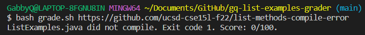
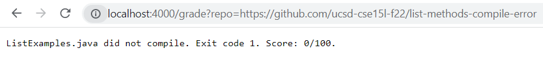
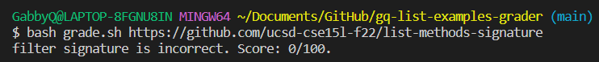
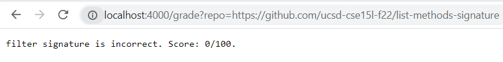
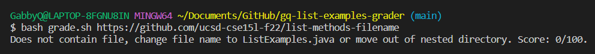

# Lab Report 5
## grade.sh Code Block
```
set -e
CPATH=".;../lib/hamcrest-core-1.3.jar;../lib/junit-4.13.2.jar" 
rm -rf student-submission
git clone --quiet $1 student-submission
cp TestListExamples.java student-submission
cp -r lib student-submission
cd student-submission

# Checks to make sure there is a file called ListExamples.java
if [[ ! -f ListExamples.java ]]
then
    echo "Does not contain file, change file name to ListExamples.java or move out of nested directory. Score: 0."
    exit 0
fi

# Checks to see if code compiles
set +e
javac ListExamples.java 2> ErrorMsg.txt
EXIT=$?
if [[ $EXIT -ne 0 ]]
then
    echo "ListExamples.java did not compile. Exit code $EXIT. Score: 0/100."
    exit 0
fi

# Checks to see if given code was corrected (line 15)
if [[ $(grep -c "result.add(0, s);" ListExamples.java) -eq 1 ]]
then
    echo "Failure inducing input still has not been fixed. Score: 0/100."
    exit 0
fi

# Checks to see if code has correct StringChecker interface
if [[ $(grep -c "interface StringChecker { boolean checkString(String s); }" ListExamples.java) -eq 0 ]]
then
    echo "StringChecker interface is incorrect. Score: 0/100."
    exit 0
fi

# Checks filter signature
if [[ $(grep -c "static List<String> filter(List<String> list, StringChecker sc) {" ListExamples.java) -eq 0 ]]
then
    echo "filter signature is incorrect. Score: 0/100."
    exit 0
fi

# Checks merge signature
if [[ $(grep -c "  static List<String> merge(List<String> list1, List<String> list2) {" ListExamples.java) -eq 0 ]]
then
    echo "merge signature is incorrect. Score 0/100."
    exit 0
fi

javac -cp $CPATH TestListExamples.java
set +e
echo "Compiled. All tests passed. Score 100/100."
java -cp $CPATH org.junit.runner.JUnitCore TestListExamples > test.txt
echo "Done"
```

## Student Submission #1: 
### https://github.com/ucsd-cse15l-f22/list-methods-compile-error



## Student Submission #2: 
### https://github.com/ucsd-cse15l-f22/list-methods-signature



## Student Submission #3:
### https://github.com/ucsd-cse15l-f22/list-methods-filename



## Trace of Student Submission #1
### For each line with a command, what its standard output and standard error are for this run, and whether its return code was zero or nonzero

### For each line with an if statement, whether the condition was true or false, and why

### Indicate each line that does not run (maybe because it is in an if branch that doesn’t evaluate, or after an early exit)