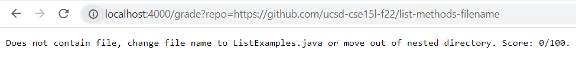
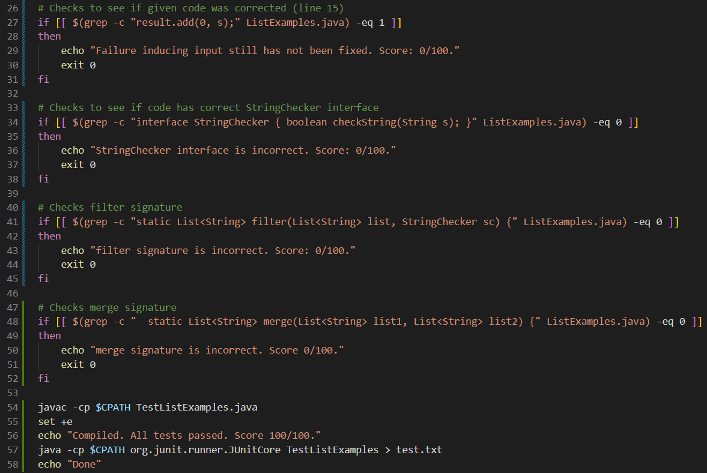

# Lab Report 5
## grade.sh Code Block
```
set -e
CPATH=".;../lib/hamcrest-core-1.3.jar;../lib/junit-4.13.2.jar" 
rm -rf student-submission
git clone --quiet $1 student-submission
cp TestListExamples.java student-submission
cp -r lib student-submission
cd student-submission

# Checks to make sure there is a file called ListExamples.java
if [[ ! -f ListExamples.java ]]
then
    echo "Does not contain file, change file name to ListExamples.java or move out of nested directory. Score: 0."
    exit 0
fi

# Checks to see if code compiles
set +e
javac ListExamples.java 2> ErrorMsg.txt
EXIT=$?
if [[ $EXIT -ne 0 ]]
then
    echo "ListExamples.java did not compile. Exit code $EXIT. Score: 0/100."
    exit 0
fi

# Checks to see if given code was corrected (line 15)
if [[ $(grep -c "result.add(0, s);" ListExamples.java) -eq 1 ]]
then
    echo "Failure inducing input still has not been fixed. Score: 0/100."
    exit 0
fi

# Checks to see if code has correct StringChecker interface
if [[ $(grep -c "interface StringChecker { boolean checkString(String s); }" ListExamples.java) -eq 0 ]]
then
    echo "StringChecker interface is incorrect. Score: 0/100."
    exit 0
fi

# Checks filter signature
if [[ $(grep -c "static List<String> filter(List<String> list, StringChecker sc) {" ListExamples.java) -eq 0 ]]
then
    echo "filter signature is incorrect. Score: 0/100."
    exit 0
fi

# Checks merge signature
if [[ $(grep -c "  static List<String> merge(List<String> list1, List<String> list2) {" ListExamples.java) -eq 0 ]]
then
    echo "merge signature is incorrect. Score 0/100."
    exit 0
fi

javac -cp $CPATH TestListExamples.java
set +e
echo "Compiled. All tests passed. Score 100/100."
java -cp $CPATH org.junit.runner.JUnitCore TestListExamples > test.txt
echo "Done"
```

## Student Submission #1: 
### https://github.com/ucsd-cse15l-f22/list-methods-compile-error


## Student Submission #2: 
### https://github.com/ucsd-cse15l-f22/list-methods-signature


## Student Submission #3:
### https://github.com/ucsd-cse15l-f22/list-methods-filename



## Trace of Student Submission #1:
### https://github.com/ucsd-cse15l-f22/list-methods-compile-error

---

### Standard Output, Standard Error, and Return Code
``set -e``

**Standard Output:** None

**Standard Error:** None

**Return Code:** Zero

``rm -rf student-submission``

**Standard Output:** 
```
removed 'student-submission/.git/config'
removed 'student-submission/.git/description'
removed 'student-submission/.git/HEAD'
removed 'student-submission/.git/hooks/applypatch-msg.sample'
removed 'student-submission/.git/hooks/commit-msg.sample'
removed 'student-submission/.git/hooks/fsmonitor-watchman.sample'
removed 'student-submission/.git/hooks/post-update.sample'
removed 'student-submission/.git/hooks/pre-applypatch.sample'
removed 'student-submission/.git/hooks/pre-commit.sample'
removed 'student-submission/.git/hooks/pre-merge-commit.sample'
removed 'student-submission/.git/hooks/pre-push.sample'
removed 'student-submission/.git/hooks/pre-rebase.sample'
removed 'student-submission/.git/hooks/pre-receive.sample'
removed 'student-submission/.git/hooks/prepare-commit-msg.sample'
removed 'student-submission/.git/hooks/push-to-checkout.sample'
removed 'student-submission/.git/hooks/update.sample'
removed directory 'student-submission/.git/hooks'
removed 'student-submission/.git/index'
removed 'student-submission/.git/info/exclude'
removed directory 'student-submission/.git/info'
removed 'student-submission/.git/logs/HEAD'
removed 'student-submission/.git/logs/refs/heads/main'
removed directory 'student-submission/.git/logs/refs/heads'
removed 'student-submission/.git/logs/refs/remotes/origin/HEAD'
removed directory 'student-submission/.git/logs/refs/remotes/origin'
removed directory 'student-submission/.git/logs/refs/remotes'
removed directory 'student-submission/.git/logs/refs'
removed directory 'student-submission/.git/logs'
removed directory 'student-submission/.git/objects/info'
removed 'student-submission/.git/objects/pack/pack-4f02f964ea7eab2a83073a8c3a82fd5bebdf76c9.idx'
removed 'student-submission/.git/objects/pack/pack-4f02f964ea7eab2a83073a8c3a82fd5bebdf76c9.pack'
removed directory 'student-submission/.git/objects/pack'
removed directory 'student-submission/.git/objects'
removed 'student-submission/.git/packed-refs'
removed 'student-submission/.git/refs/heads/main'
removed directory 'student-submission/.git/refs/heads'
removed 'student-submission/.git/refs/remotes/origin/HEAD'
removed directory 'student-submission/.git/refs/remotes/origin'
removed directory 'student-submission/.git/refs/remotes'
removed directory 'student-submission/.git/refs/tags'
removed directory 'student-submission/.git/refs'
removed directory 'student-submission/.git'
removed 'student-submission/ErrorMsg.txt'
removed 'student-submission/lib/hamcrest-core-1.3.jar'
removed 'student-submission/lib/junit-4.13.2.jar'
removed directory 'student-submission/lib'
removed 'student-submission/ListExamples.java'
removed 'student-submission/TestListExamples.java'
removed directory 'student-submission'
```

**Standard Error:** None

**Return Code:** Zero

``git clone --quiet $1 student-submission``

**Standard Output:** None

**Standard Error:** Cloning into 'student-submission'...

**Return Code:** Zero

``cp TestListExamples.java student-submission``

**Standard Output:** None

**Standard Error:** None

**Return Code:** Zero

``cp -r lib student-submission``

**Standard Output:** None

**Standard Error:** None

**Return Code:** Zero

``cd student-submission``

**Standard Output:** None

**Standard Error:** None

**Return Code:** Zero

``if [[ ! -f ListExamples.java ]]``

**Standard Output:** None

**Standard Error:** None

**Return Code:** Zero


``echo "Does not contain file, change file name to ListExamples.``

**Standard Output:** None

**Standard Error:** None

**Return Code:** Zero

``java or move out of nested directory. Score: 0/100."``

**Standard Output:** None

**Standard Error:** None

**Return Code:** Zero

``exit 0``

**Standard Output:** None

**Standard Error:** None

**Return Code:** Zero

``set +e``

**Standard Output:** None

**Standard Error:** None

**Return Code:** Zero

``javac ListExamples.java 2> ErrorMsg.txt``

**Standard Output:** None

**Standard Error:** None
```
ListExamples.java:15: error: ';' expected
        result.add(0, s)
                        ^
1 error
```

**Return Code:** Zero

``if [[ $EXIT -ne 0 ]]``

**Standard Output:** None

**Standard Error:** None

**Return Code:** Zero

``echo "ListExamples.java did not compile. Exit code $EXIT. Score: 0/100."``

**Standard Output:** None

**Standard Error:** None
 
**Return Code:** Zero

``exit 0``

**Standard Output:** None

**Standard Error:** None

**Return Code:** Zero

---

### If Statement: T/F Conditions
1. ``if [[ ! -f ListExamples.java ]]``

True, because the ListExamples.java does exist in the current directory.

2. ``if [[ $EXIT -ne 0 ]]``

False, because ``javac ListExamples.java 2> ErrorMsg.txt`` results in exit code 1, which is not equal to 0.

3. ``if [[ $(grep -c "result.add(0, s);" ListExamples.java) -eq 1 ]]``

Does not run becuase the program has exited after ``if [[ $EXIT -ne 0 ]]``. 

4. ``if [[ $(grep -c "interface StringChecker { boolean checkString(String s); }" ListExamples.java) -eq 0 ]]``

Does not run becuase the program has exited after ``if [[ $EXIT -ne 0 ]]``. 

5. ``if [[ $(grep -c "static List<String> filter(List<String> list, StringChecker sc) {" ListExamples.java) -eq 0 ]]``

Does not run becuase the program has exited after ``if [[ $EXIT -ne 0 ]]``. 

6. ``if [[ $(grep -c "  static List<String> merge(List<String> list1, List<String> list2) {" ListExamples.java) -eq 0 ]]``

Does not run becuase the program has exited after ``if [[ $EXIT -ne 0 ]]``. 

---

### Lines That Don't Run
All of the code after the ``if [[ $EXIT -ne 0 ]]`` branch does not run, because of the early in-branch exit.
